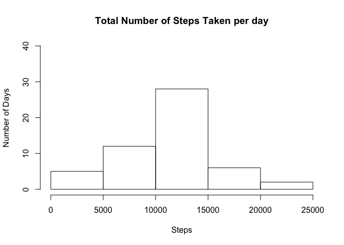
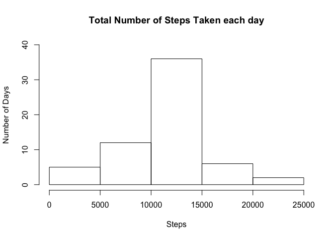
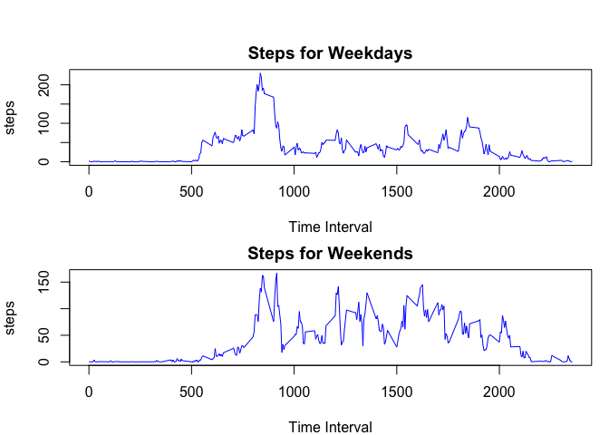

## Loading and preprocessing the data


## What is mean total number of steps taken per day?

```r
totalSteps <- aggregate(steps~date, data=walkdata, sum, na.rm=TRUE)
hist(totalSteps$steps,
    main="Total Number of Steps Taken per day",
    xlab = "Steps",
    ylab = "Number of Days",
    ylim = c(0,40),
    )
```

<!-- -->

```r
meanSteps <- mean(totalSteps$steps)
medianSteps <- median(totalSteps$steps)
print(meanSteps)
```

```
## [1] 10766.19
```

```r
print(medianSteps)
```

```
## [1] 10765
```

## What is the average daily activity pattern?

```r
stepsToInterval <- aggregate(steps~interval, data=walkdata, mean, na.rm=TRUE)
plot(steps~interval,data=stepsToInterval,type="l")
```

<!-- -->


```r
max5minsinterval <- stepsToInterval[which.max(stepsToInterval$steps),]$interval
print(max5minsinterval)
```

```
## [1] 835
```

## Imputing missing values
#### Calcuate total number of missing values

```r
totalMissing <- sum(is.na(walkdata$steps))
print(totalMissing)
```

```
## [1] 2304
```

#### Create a new dataset with missing data filled in


#### Histogram

```r
totalNewSteps <- aggregate(steps~date, data = newdata, sum, na.rm=TRUE)
hist(totalNewSteps$steps,
     main="Total Number of Steps Taken each day",
     xlab="Steps",
     ylab="Number of Days",
     ylim=c(0,40))
```

<!-- -->

#### Calculate mean and median

```r
meanNewSteps <- mean(totalNewSteps$steps)
medianNewSteps <- median(totalNewSteps$steps)
print(meanNewSteps)
```

```
## [1] 10766.19
```

```r
print(medianNewSteps)
```

```
## [1] 10766.19
```

## Are there differences in activity patterns between weekdays and weekends?
#### Create new factor variable with two levels - "weekday" and "weekend"

```r
newdata$type_of_day <- weekdays(as.Date(newdata$date))
newdata$type_of_day[newdata$type_of_day %in% c('Saturday','Sunday')] <- "Weekend"
newdata$type_of_day[newdata$type_of_day !="Weekend"] <- "Weekday"
newdata$type_of_day <- as.factor(newdata$type_of_day)

Weekday_data <- subset(newdata, type_of_day=="Weekday")
Weekday_stepsToInterval <- aggregate(steps~interval, data=Weekday_data, mean)

Weekend_data <- subset(newdata, type_of_day=="Weekend")
Weekend_stepsToInterval <- aggregate(steps~interval, data=Weekend_data, mean)
```

#### Panel plot

```r
par(mfrow=c(2,1), mar=c(4,4,2,1), oma=c(0,0,2,0))

with(newdata, {
    plot(steps~interval,data=Weekday_stepsToInterval,type="l",
main="Steps for Weekdays", xlab="Time Interval", col="blue")
    plot(steps~interval,data=Weekend_stepsToInterval,type="l",
main="Steps for Weekends", xlab="Time Interval", col="blue")
    })
```

<!-- -->
